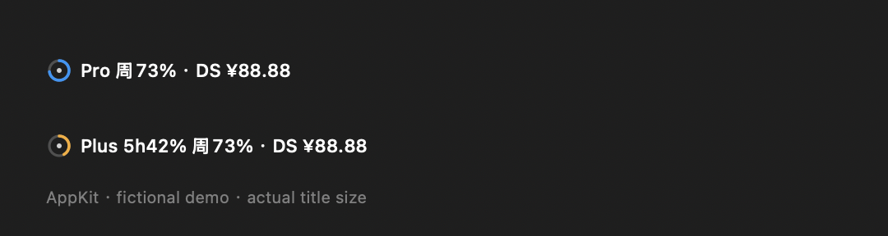
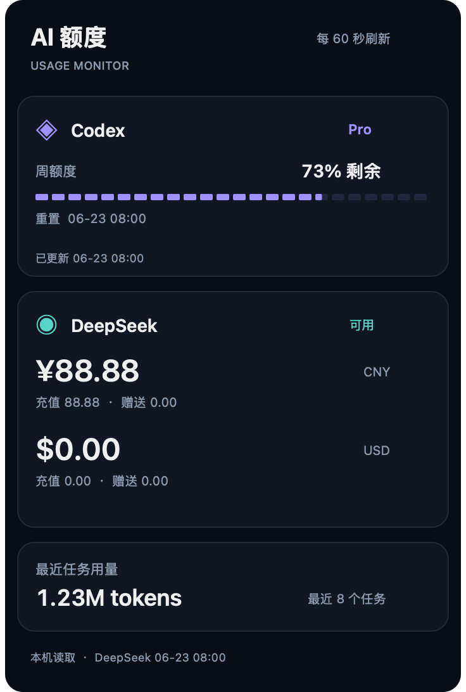
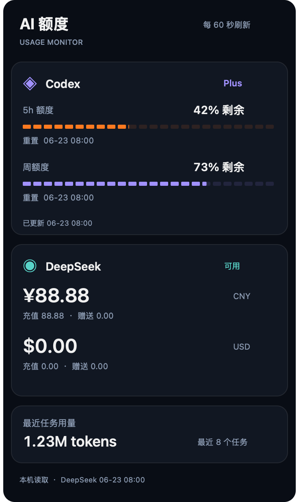

# Codex Usage Bar

**v0.11.0 · 小更新 · 第 2 次公开迭代**

[版本下载](docs/downloads.md) · [更新日志](CHANGELOG.md) · [维护计划](docs/maintenance.md) · [版本规则](docs/versioning.md) · [MIT 许可](LICENSE)


在 Mac 菜单栏查看 **Codex 剩余额度、DeepSeek 官方 API 余额与本机任务用量**。无需反复切换页面：抬眼看摘要，点击看详情。Swift + AppKit 原生实现，仅驻留菜单栏，没有桌面悬浮组件。

[菜单栏怎么看](#菜单栏怎么看) · [展开面板](#展开面板) · [完整功能](#完整功能) · [构建和运行](#构建和运行) · [DeepSeek 配置](#deepseek-官方-api-余额)

## 菜单栏怎么看

菜单栏展示的是 **Codex 订阅剩余额度百分比**与 **DeepSeek API 账户货币余额**，两者分别统计。

### 紧凑布局预览



上图为 **v0.12.0 待发布布局**，使用本项目 AppKit 标题离屏渲染及虚构数据，不是桌面截图。已完成本地实现；当前正式 Release 为 v0.11.0。不要将此预览当作旧版下载包的外观。

| 内容 | 含义与使用方法 |
| --- | --- |
| 左侧圆环 | Codex 额度的图形摘要，配合右侧百分比查看。 |
| `Pro` / `Plus` | 当前套餐；Pro Lite 在菜单栏简写为 Pro，详情保留完整名称。 |
| `5h42%` | 5 小时窗口剩余 42%；Plus 保留接口返回的 5h 窗口。 |
| `周73%` | 周窗口剩余 73%；按接口实际返回窗口展示，不伪造缺失额度。 |
| `DS ¥88.88` | DS 是 DeepSeek；人民币余额为 88.88 元。紧凑版优先非零人民币，其次其他非零币种，不把不同货币相加。 |
| 鼠标悬停 | 查看套餐、窗口及 DeepSeek 完整币种余额；读取失败时查看状态说明。 |
| 点击菜单栏 | 展开深色概览面板；进入「用量与任务详情」查看更完整信息。 |

紧凑版减少空白、冗余分隔和零余额币种占位，文字使用等宽数字。上述 Pro／Plus 示例文字分别约 128／175 pt，不含圆环及系统留白；可减少刘海附近的拥挤，实际可用空间仍受其他菜单栏项目影响。

<details>
<summary>当前正式版 v0.11.0 的菜单栏格式</summary>

```text
◉ Pro · 周 73% | DeepSeek ¥88.88 / $0.00
◉ Plus · 5h 42% / 周 73% | DeepSeek ¥88.88 / $0.00
```

正式版使用 DeepSeek 全称，并列出接口返回的所有币种；紧凑布局的 DS 简称与主要币种选择属于待发布改进。上述数值均为示例。

</details>

## 展开面板

| Pro 单周额度 | Plus 5h ＋ 周额度 |
| --- | --- |
|  |  |

以上是 **v0.11.0 本项目原生视图离屏渲染**，额度、余额与日期为虚构演示数据。图片展示自绘面板，不含底部原生操作菜单；底部操作和二级菜单也统一使用深色外观。

- **Codex 卡片**：套餐、剩余百分比、分段额度条及窗口重置信息，按实际窗口布局。
- **DeepSeek 卡片**：按币种查看官方账户余额、可用状态与更新时间。
- **任务用量**：最近 8 个任务的 token 合计；详细菜单继续查看当前任务和最近任务记录。
- **底部操作**：「用量与任务详情」展开二级菜单；「刷新」立即更新；「退出」关闭本工具。

图片生成脚本：`python3 scripts/render_gallery.py`；紧凑版预览：`python3 scripts/render_menubar.py`（包含兼容正式版源码的演示格式器）。参考来源见[致谢](docs/credits.md)。

## 完整功能

| 功能 | 提供的信息 |
| --- | --- |
| Codex 套餐适配 | Pro／Pro Lite、Plus 标签；实际返回的 5h、周窗口及剩余比例。 |
| 重置与重置券 | 各窗口重置日期时间；接口提供时展示可用完整重置次数及券的到期时间。仅查看，不消耗重置券。 |
| DeepSeek 官方余额 | 币种、总余额、充值余额、赠送余额、账户可用状态和成功更新时间。 |
| 当前任务 | 本机记录中的任务标题、模型、累计 token 和可计算时的上下文剩余比例。 |
| 最近任务 | 最近 8 个任务的 token 合计，详情列出最多 5 条最近任务摘要。 |
| 自动与手动刷新 | 每 60 秒更新；支持手动刷新。DeepSeek 独立异步查询。 |
| 错误与缓存 | Codex 读取失败时可使用本地缓存并标注状态；DeepSeek 失败显示未知状态，不沿用旧余额。 |
| 原生轻量界面 | macOS 菜单栏圆环与数字、深色卡片、深色详情菜单；无桌面悬浮组件。 |

任务 token 来自本机记录，**不是 API 账单金额，也不用于反推订阅剩余额度**。没有任务或数据不可用时显示对应状态。

## 构建和运行

需要 macOS 13+、Xcode Command Line Tools，以及已登录的 Codex 桌面应用。

```bash
bash build_app.sh
open build/CodexUsageBarTotal.app
```

安装到当前用户的 Applications：

```bash
OUTPUT_DIR="$HOME/Applications" bash build_app.sh
open "$HOME/Applications/CodexUsageBarTotal.app"
```

构建脚本执行本地临时签名，不提供 Apple 公证。可将安装后的应用加入 macOS 登录项。

## 数据与兼容性

工具通过本地 app-server 的 `account/rateLimits/read` 读取账号额度，按实际窗口时长排序。它会在需要时启动监听于 `127.0.0.1:47891` 的后台服务。默认检查 `/Applications/Codex.app` 和 `/Applications/ChatGPT.app`，自定义位置可通过进程环境变量 `CODEX_BINARY` 指定。

缓存及后台日志位于当前用户的 `~/.codex/`。最近任务读取 `~/.codex/state_5.sqlite`；此数据库和 app-server 接口属于本地实现细节，未来版本变化可能需要适配。切换账号或升级套餐后，旧后台服务可能暂时返回旧额度。

源码仓库不包含凭据、账号额度缓存、任务记录、日志或数据库。应用不提供额外遥测上传；Codex 后台自身的联网和遥测行为由所用客户端决定。

本项目为非官方工具，与 OpenAI 无隶属关系。早期交互参考 QuotaDot 与 codex-float；当前版本已移除悬浮组件实现。

## DeepSeek 官方 API 余额

菜单栏同时显示 DeepSeek 余额，下拉菜单提供币种、充值余额、赠送余额及可用状态。每 60 秒独立查询一次；网络或鉴权失败显示未知状态，不沿用旧余额。

凭据优先从应用进程环境变量 `DEEPSEEK_API_KEY` 读取，否则读取当前用户的 `~/.codex/secrets/deepseek-api-key`。密钥仅发送到官方 `https://api.deepseek.com/user/balance` 查询接口，不写入源码、日志或余额缓存。此文件应仅允许当前用户读取。

## 开发验证

运行 `bash scripts/check.sh` 检查解析、公开文件和构建；无需真实 API Key 或付费模型调用。GitHub Actions 使用相同入口。构建验证不代表所有桌面交互已验收。
